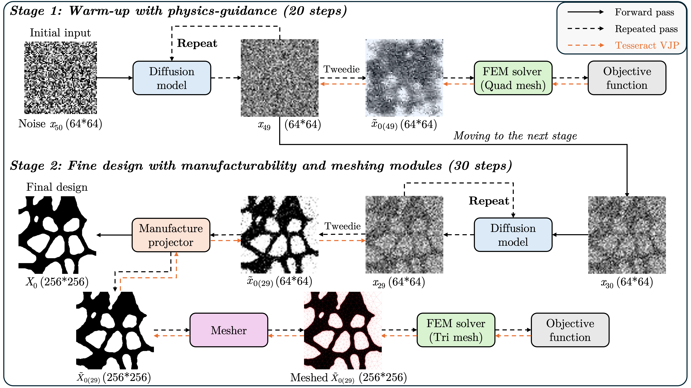
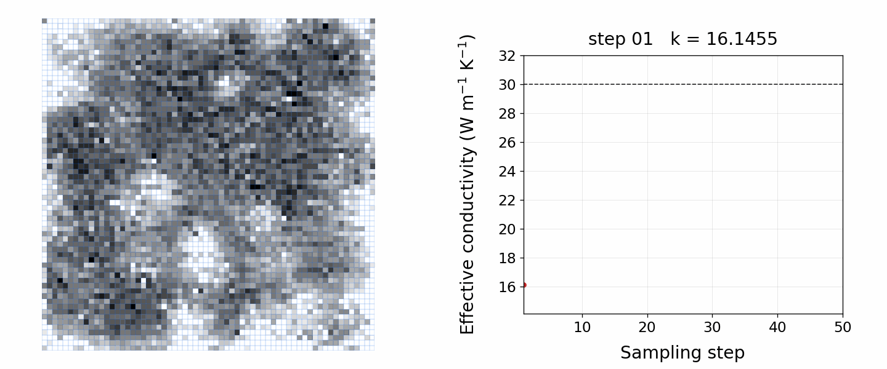

# Tesseract Physics-Guided Diffusion Design

A project for the Tesseract Hackathon, Track 1: **Inverse Design & Shape Optimization**.

This project combines physics-guided diffusion, manufacturability constraints,
interface-conforming Gmsh meshing, and differentiable thermal FEM into one
modular inverse-design workflow.

### Video walkthrough

We prepared a five-minute walkthrough of the workflow and its results:
[watch the demo on YouTube](https://www.youtube.com/watch?v=wj88fCwxIfs).

### Project write-up

The detailed methodology, differentiable interfaces, and experimental results
are described in the accompanying [project write-up](write_up.pdf).

### Tesseract workflow

The workflow is built from four native Tesseract components:



The first 20 sampling steps use the original structured 64×64 QUAD4 JAX-FEM guidance. From step 21, the candidate geometry is filtered and made manufacturable, meshed by strict Gmsh, evaluated by TRI3 thermal FEM, and differentiated back to the diffusion field through the manufacturing and meshing VJPs.

| Component | Forward computation | Reverse computation |
|---|---|---|
| `tes1_diffusion` | VP-SDE reverse update with physics guidance | JAX VJP |
| `tes2_manufacture` | 4× upsampling, filtering, SDF smoothing, feature and connectivity checks | surrogate VJP |
| `tes3_mesher` | strict, interface-conforming Gmsh TRI3 mesh | frozen-topology VJP |
| `tes4_fem` | differentiable thermal TRI3 solve | JAX VJP for conductivity and coordinates |

## Design result



## Prerequisites

1. Docker Desktop or Docker Engine must be running.
2. Conda is required to create the tested Python environment.
3. Download `vpsde_model_6400.flax` from the GitHub Releases page and place it at `diffusion/models/vpsde_model_6400.flax`. The trained checkpoint is distributed separately because of its size.

Create the complete environment from the repository root:

```bash
conda env create -f environment.yml
conda activate tes-phy-guide
```

The environment file installs PETSc/`petsc4py`, JAX, JAX-FEM, Gmsh, Flax, Tesseract, and all remaining runtime dependencies.

## Build the Tesseract components

Run these commands from the repository root:

```bash
tesseract build tesseract_workflow/components/tesseracts/tes1_diffusion
tesseract build tesseract_workflow/components/tesseracts/tes2_manufacture
tesseract build tesseract_workflow/components/tesseracts/tes3_mesher
tesseract build tesseract_workflow/components/tesseracts/tes4_fem
```

The mesher image installs native Linux `gmsh`; users do not need Gmsh on the host.

## Run the complete Tesseract workflow

From the repository root:

```bash
PYTHONPATH=.:tesseract_workflow/src \
python tesseract_workflow/app/docker_full_pipeline.py \
  --steps 50 \
  --manufacturing-start 20 \
  --seed 123 \
  --target 30.0 \
  --model diffusion/models/vpsde_model_6400.flax \
  --output-dir tesseract_workflow/results/tesseract_full
```

Users can choose their own design targets to generate different structures.

The orchestration script starts the four images through the Tesseract Python API. It does not call Gmsh or the TRI3 FEM solver on the host.

The output directory contains:

```text
steps/x0/            Tweedie x0 estimates (PNG + NPY), 50 steps
steps/diffusion/     sampled x_{t-1} states (PNG + NPY), 50 steps
steps/manufacture/   manufactured masks, steps 21–50
steps/mesh/          Gmsh TRI3 plots, steps 21–50
steps/temperature/   TRI3 temperature plots, steps 21–50
docker_run_data.npz  arrays and scalar histories
metrics.json         configuration and final conductivity
```

## Reproducibility record

On Apple Silicon (`linux/arm64`), the Conda setup, all four `tesseract build` commands, and the complete 50-step workflow were verified from a clean environment. The final effective conductivity was `30.04953` for a target of `30.0`.
